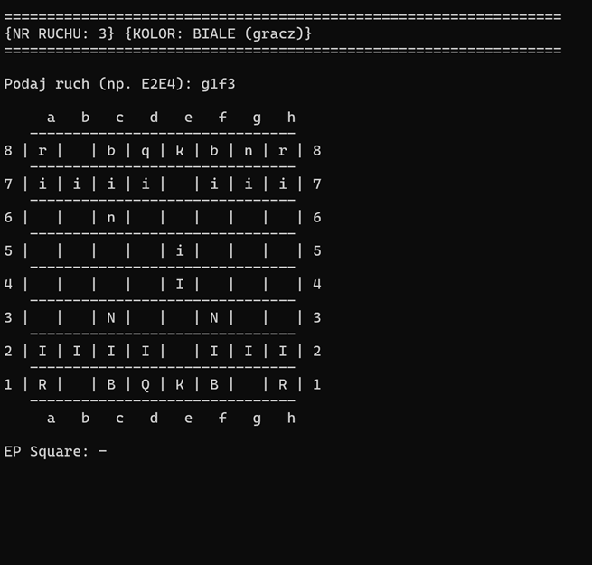
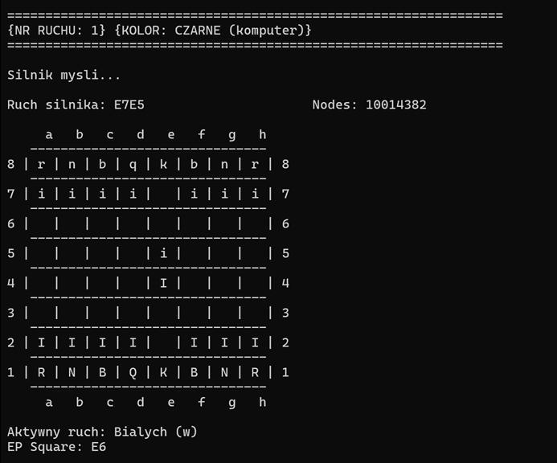

# Nearr 1.1 - Silnik Szachowy C++

**Nearr 1.1** to silnik szachowy oparty na architekturze bitowej (**Bitboards**), stworzony w ramach zaliczenia przedmiotu **Programowanie I na 1. semestrze studiów inżynierskich**.

---

## 🏆 Status Projektu i Sukcesy
* **Ranking Lichess:** ~2000 ELO (Rapid). 
* **Profil bota:** [@BilboB47](https://lichess.org/@/BilboB47) – zapraszam do rozegrania partii!
* **Wyniki testowe:** Silnik Nearr 1.1 z powodzeniem rywalizował z silnikami klasy mistrzowskiej:
  * ✅ Wygrana partia przeciwko **Komodo 17**
  * ✅ Wygrana partia przeciwko **Komodo 18**
  * 🤝 Remis w partii przeciwko **Komodo 19**
* **Finalizacja:** Wersja 1.1 jest wersją ostateczną tego silnika. Wszystkie założenia projektowe zostały zrealizowane, a kolejny projekt będzie budowany od podstaw w ramach nowej architektury.

---

## 🖼️ Podgląd Rozgrywki

Poniżej przedstawiono przebieg tury z perspektywy gracza oraz proces decyzyjny silnika w konsoli.

| Ruch Gracza | Ruch Silnika (Bot) |
| :---: | :---: |
|  |  |

---

## ⚙️ Kluczowe Funkcjonalności

### I. Reprezentacja i Generowanie Ruchów
* **Bitboards:** Wykorzystanie 64-bitowych masek do błyskawicznych operacji na stanach planszy.
* **Magic Bitboards:** Zaawansowana technika generowania ruchów figur dalekosiężnych (Wieże, Gońce, Hetmany) za pomocą predefiniowanych tabel "magicznych".
* **Zobrist Hashing:** Implementacja unikalnych kluczy pozycji, pozwalająca na błyskawiczne operacje na Tablicy Transpozycji oraz detekcję powtórzeń.

### II. Silnik Szukający (Search)

* **Alpha-Beta Pruning:** Klasyczny algorytm optymalizacji przeszukiwania, redukujący liczbę analizowanych gałęzi.
* **Iterative Deepening:** Strategia szukania warstwowego, umożliwiająca lepsze sortowanie ruchów i kontrolę czasu.
* **Transposition Table (TT):** Globalna tablica mieszająca przechowująca wyniki (Score, Depth, Flags). Pozwala uniknąć ponownego przeliczania tych samych pozycji.
* **Quiescence Search:** Specjalna faza szukania "ciszy" na końcach gałęzi, eliminująca błędy wynikające z tzw. efektu horyzontu.
* **Killer Heuristic:** Zapamiętywanie ruchów, które spowodowały odcięcia w innych gałęziach, co drastycznie przyspiesza proces szukania.

### III. Ewaluacja i Taktyka
* **Tapered Evaluation:** Dynamiczne przechodzenie między fazą gry środkowej a końcówką.
* **PST (Piece-Square Tables):** Pozycjonowanie figur w oparciu o ich strategiczne umiejscowienie na szachownicy.
* **Mate Distance Pruning:** Logika dążąca do zadania mata w jak najmniejszej liczbie posunięć.

---

## 🚀 Uruchamianie i Konfiguracja

Wybór trybu pracy silnika następuje w pliku `main.cpp` poprzez odkomentowanie odpowiedniej funkcji:

```cpp
int main() {
    // TRYB 1: Gra bezpośrednia w konsoli (człowiek vs bot)
    start_game(); 

    // TRYB 2: Protokół UCI (do gry na Lichess lub w zewnętrznych GUI)
    // uci_loop(); 

    return 0;
}
```

---

### Jak uruchomić?
1. Skompiluj projekt za pomocą MSVC (Visual Studio) lub GCC/Clang.
2. Uruchom plik binarny.
3. Postępuj zgodnie z instrukcjami w konsoli, aby rozpocząć partię!
